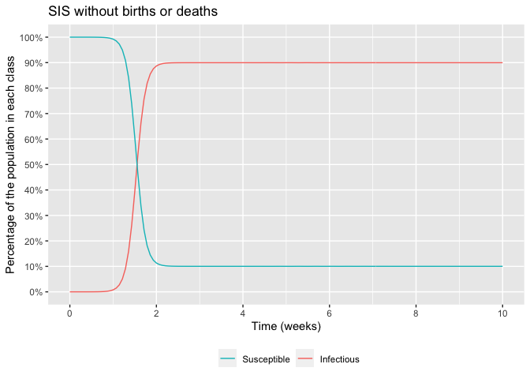

SIS without births or deaths
================
Bill Behrman
2020-04-12

  - [Model](#model)
  - [Plot](#plot)

``` r
# Libraries
library(tidyverse)
library(diffeqr)

#===============================================================================

# Setup ODE solver
diffeq_setup() %>% 
  invisible()
```

## Model

``` r
# Derivative function
f <- JuliaCall::julia_eval("
function f(du, u, p, t)
  du[1] = p[2] * u[2] - p[1] * u[1] * u[2]
  du[2] = p[1] * u[1] * u[2] - p[2] * u[2]
  return nothing
end
")

# Model parameters
p <- 
  c(
    beta = 520 / 365,
    gamma = 1 / 7
  )

# Initial conditions
u0 <- 
  c(
    s0 = 1 - 1e-6,
    i0 = 1e-6
  )

# Time range for solution and time increment
t0 <- 0
t_end <- 70
t_inc <- 0.5

tspan <- c(t0, t_end)
saveat <- seq(t0, t_end, t_inc)

# Solve model ODE
sol <- 
  ode.solve(f = 'f', u0 = u0, tspan = tspan, p = p, saveat = saveat) %>% 
  map_dfc(as_tibble) %>% 
  rename(s = V1, i = V2, t = value)
```

## Plot

``` r
sol %>% 
  pivot_longer(cols = -t, names_to = "class", values_to = "prop") %>% 
  ggplot(aes(t, prop, color = class)) +
  geom_line() +
  scale_x_continuous(
    breaks = scales::breaks_width(2 * 7),
    labels = scales::label_number(accuracy = 1, scale = 1 / 7)
  ) +
  scale_y_continuous(
    breaks = scales::breaks_width(0.1),
    minor_breaks = NULL,
    labels = scales::label_percent(accuracy = 1)
  ) +
  scale_color_discrete(
    name = NULL,
    breaks = c("s", "i"),
    labels = c("Susceptible", "Infectious"),
  ) +
  theme(legend.position = "bottom") +
  labs(
    title = "SIS without births or deaths",
    x = "Time (weeks)",
    y = "Percentage of the population in each class"
  )
```

<!-- -->
